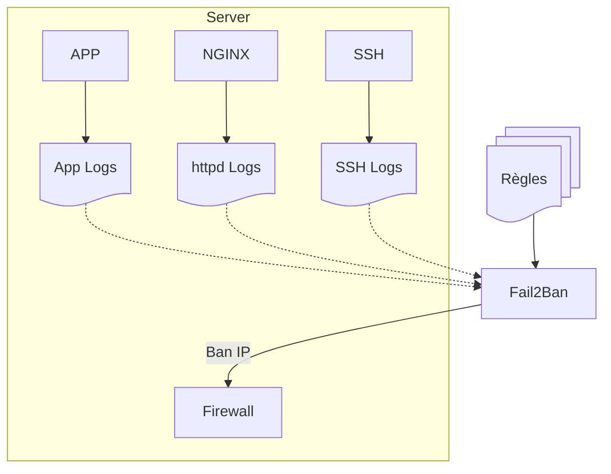
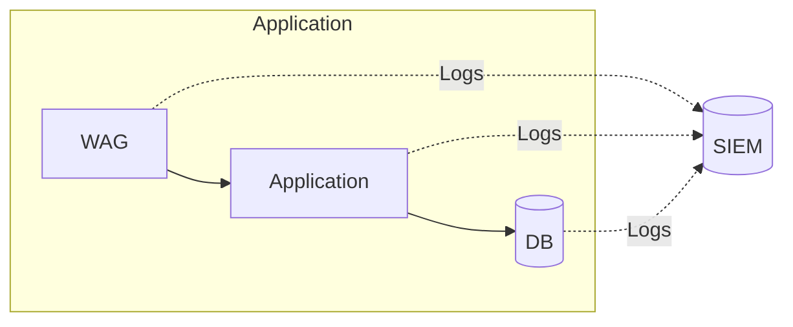
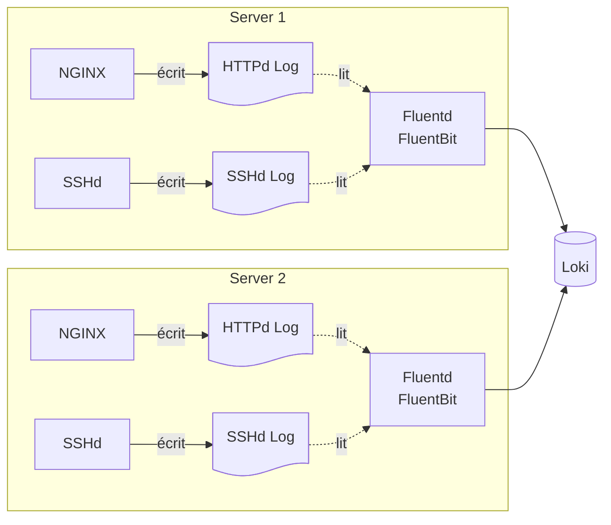

---
# You can also start simply with 'default'
theme: seriph
# random image from a curated Unsplash collection by Anthony
# like them? see https://unsplash.com/collections/94734566/slidev
background: https://cover.sli.dev
hideInToc: true
# some information about your slides (markdown enabled)
title: DIY SIEM W/ Sigma & Loki
info: |
  ## Slidev Starter Template
  Presentation slides for developers.

  Learn more at [Sli.dev](https://sli.dev)
# apply unocss classes to the current slide
class: text-center
# https://sli.dev/features/drawing
drawings:
  persist: false
# slide transition: https://sli.dev/guide/animations.html#slide-transitions
transition: slide-left
# enable MDC Syntax: https://sli.dev/features/mdc
mdc: true
# open graph
# seoMeta:
#  ogImage: https://cover.sli.dev
---

# DIY SIEM

Built using Sigma & Loki

  <button @click="$slidev.nav.openInEditor()" title="Open in Editor" class="slidev-icon-btn">
    <carbon:edit />
  </button>
  <a href="https://github.com/slidevjs/slidev" target="_blank" class="slidev-icon-btn">
    <carbon:logo-github />
  </a>

<!--
The last comment block of each slide will be treated as slide notes. It will be visible and editable in Presenter Mode along with the slide. [Read more in the docs](https://sli.dev/guide/syntax.html#notes)
-->

---
hideInToc: true
layout: center
---

# $ whoami

---
hideInToc: true
---
# ToC

<Toc text-sm minDepth="1" maxDepth="2" />

---
level: 1
---

# Fail2Ban

---
level: 2
layout: two-cols-header
---

# I <3 Fail2Ban

::left::

## Pro

Dernière ligne de défense

::right::

## Con

Scope limité à une machine(*)

::bottom::

(*) De nombreux hacks sont proposés pour contourner la limitation d'une machine, mais l'applicabilité est très limitée

---
layout: section
---

# Wazuh

## Self-Hosted SIEM + XDR

 

- EDR: Endpoint Detection & Response
- XDR: eXtended Detection & Response

---
layout: two-cols-header
level: 2
---

# Je ne recommande pas

::left::

## Specs Recommandées

1-25 agents

- 4 vCPU
- 8 GB RAM
- 50 GB HDD (90d)

::right::

## OoM'd on

1 agent

- 8 Cores
- 32 GB RAM
- 2 TB SSD

::bottom::

🪦

---
level: 3
layout: image-left
image: https://turnoff.us/image/en/oom-killer.png
---

Daniel Stori

[turnoff.us](https://turnoff.us)

[Source](https://turnoff.us/geek/oom-killer/)

<!-- I don't always kill processes, but when I do, I kill JVM processes first -->

---
level: 1
---

# Glossaire

- SIEM: Security Information & Event Monitoring
- SOAR: Security Orchestration, Automation & Response

- CIEM: Cloud Infrastructure Entitlement Management

---
level: 1
layout: section
---

# SIEM

Security Information & Event Management

---
level: 2
---

#### Déjà entendu parler de modifier les logs pour cacher sa présence?

---
level: 2
---

# Centralisation des logs

---
layout: section
level: 2
---

# Loki

## J'vous ai déjà dit que j'aime ce log backend?

---
level: 3
---

# Loki

---
layout: section
level: 2
---

# Détection

## Parce que moi non plus, je ne lis pas mes logs

---
layout: section
---

# Sigma

## The shareable detection format for security professionals

[https://sigmahq.io/](https://sigmahq.io/)

---
layout: end
---

# Questions ?
# Commentaires ?
# Insultes ?
 
<PoweredBySlidev/>
